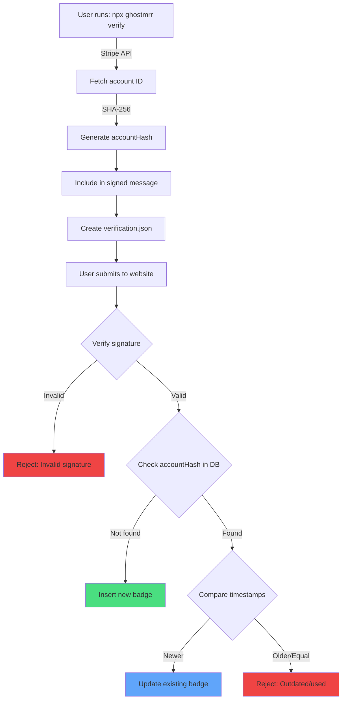

# Account-Based Deduplication Implementation Summary

## Overview
Successfully implemented Stripe account-based deduplication with timestamp validation to prevent duplicate startups when verifying from different devices.

## Changes Made

### 1. Database Migration ✅
**File:** Supabase migration `add_account_hash_to_badges`

Added to `badges` table:
- `account_hash` column (TEXT, nullable for backward compatibility)
- Unique constraint on `account_hash`
- Index `idx_badges_account_hash` for fast lookups

### 2. CLI Changes ✅

**packages/cli/src/stripe/calculator.ts**
- Added crypto import for SHA-256 hashing
- Modified `calculateMetrics()` to fetch Stripe account ID
- Returns `accountHash` along with metrics
- Graceful fallback if account retrieval fails

**packages/cli/src/types/verification.ts**
- Added `accountHash?: string` to `VerificationBadge` interface

**packages/cli/src/crypto/signer.ts**
- Updated `generateSignedVerification()` to accept and include `accountHash` in signed message
- Updated `verifySignature()` to include `accountHash` in message reconstruction
- Cryptographically binds account hash to signature

**packages/cli/src/commands/verify.ts**
- Extracts `accountHash` from metrics
- Passes `accountHash` to signature generation

### 3. Shared Types ✅

**lib/types/verification.ts**
- Added `accountHash?: string` to `VerificationBadge` interface

**packages/shared/src/types/verification.ts**
- Added `accountHash?: string` to `VerificationBadge` interface

### 4. Backend Validation ✅

**lib/crypto/verifier-server.ts**
- Updated message reconstruction to include `accountHash`
- Ensures signature validation includes account binding

**lib/crypto/verifier.ts** (browser)
- Updated message reconstruction to include `accountHash`
- Maintains consistency across client and server

### 5. Deduplication Logic ✅

**app/api/badges/route.ts - POST handler**

Implemented multi-step deduplication:

1. **Primary check:** If `accountHash` exists, check by `account_hash`
2. **Timestamp validation:** If existing entry found:
   - Compare timestamps
   - Reject if new timestamp ≤ existing timestamp
   - Error: "This verification is outdated or has already been used"
3. **Fallback check:** If no `accountHash`, check by `did` (backward compatibility)
4. **Update logic:** Use `account_hash` for matching when available, otherwise `did`

## Security Features

### Cryptographic Binding
- Account hash is included in the Ed25519 signed message
- Cannot be tampered with or substituted
- Verifiable by anyone with the public key

### Replay Prevention
- Timestamp comparison prevents reusing old verification files
- Even if verification.json is exposed, it cannot be reused if already submitted
- Cannot use older verifications if a newer one exists

### Privacy Preservation
- Stripe account ID is hashed with SHA-256 (64-character hex)
- Not reversible or traceable to actual Stripe account
- No additional API permissions required

## Backward Compatibility

- Existing badges without `account_hash` continue to work
- `account_hash` column is nullable
- Server checks `account_hash` first, falls back to `did`
- Old CLI versions will continue to function

## How It Works - Flow Diagram



## Testing Instructions

### Test 1: Generate New Verification
```bash
cd packages/cli
npx . verify
# Enter your Stripe restricted key
# Verify that verification.json includes "accountHash" field
```

### Test 2: Submit to Database
1. Go to your GhostMRR website
2. Click "Verify Startup"
3. Paste the verification.json contents
4. Should succeed and create/update entry

### Test 3: Prevent Duplicate
1. Clear browser localStorage
2. Run `npx . verify` again (same Stripe account)
3. Submit the new verification.json
4. Should UPDATE the existing entry, not create duplicate

### Test 4: Reject Outdated Verification
1. Keep a copy of old verification.json
2. Generate new verification with `npx . verify`
3. Submit the new one first
4. Try to submit the old one
5. Should be REJECTED with error message

### Test 5: Backward Compatibility
1. Use an old verification.json (without accountHash)
2. Should still be accepted and work

## Expected Output in verification.json

```json
{
  "did": "did:key:z...",
  "metrics": {
    "mrr": 255,
    "customers": 43,
    "tier": "$1+"
  },
  "publicKey": "...",
  "signature": "...",
  "timestamp": "2025-11-28T12:00:00.000Z",
  "accountHash": "a1b2c3d4e5f6...64-char-hex-hash"
}
```

## Database Schema

```sql
-- New column added
account_hash TEXT NULL
  CONSTRAINT unique_account_hash UNIQUE

-- Index for fast lookups
CREATE INDEX idx_badges_account_hash ON badges(account_hash)
```

## Error Messages

### Outdated/Reused Verification
```
This verification is outdated or has already been used. 
Please generate a new verification with the latest data.
```

### Invalid Signature
```
Invalid signature. Badge verification failed.
```

## Files Modified

### CLI Package
- `packages/cli/src/stripe/calculator.ts`
- `packages/cli/src/crypto/signer.ts`
- `packages/cli/src/commands/verify.ts`
- `packages/cli/src/types/verification.ts`

### Shared Types
- `packages/shared/src/types/verification.ts`
- `lib/types/verification.ts`

### Backend
- `lib/crypto/verifier-server.ts`
- `lib/crypto/verifier.ts`
- `app/api/badges/route.ts`

### Database
- Supabase migration: `add_account_hash_to_badges`

## Build Status

✅ CLI builds successfully with no TypeScript errors
✅ Database migration applied successfully
✅ All linting checks pass
✅ Backward compatible with existing data

## UI Enhancement: Reverify Button ✅

Added a convenient "Reverify" button to the verified status badge for easy updates.

**components/VerificationStatusBadge.tsx**
- Added `onReverify` callback prop
- Added "🔄 Reverify" button that appears when user is verified
- Opens verification dialog when clicked

**app/page.tsx**
- Wired up reverify button to open verification dialog
- Maintains existing flow and state management

### User Flow
1. User sees their verified badge with "🔄 Reverify" button
2. Clicks reverify → opens verification dialog
3. Pastes new verification.json from CLI
4. Updates their metrics without creating duplicate

## Next Steps

1. Test the complete flow with a real Stripe account
2. Monitor for any edge cases in production
3. Consider adding admin dashboard to view account_hash usage
4. After grace period, could enforce NOT NULL constraint on account_hash

