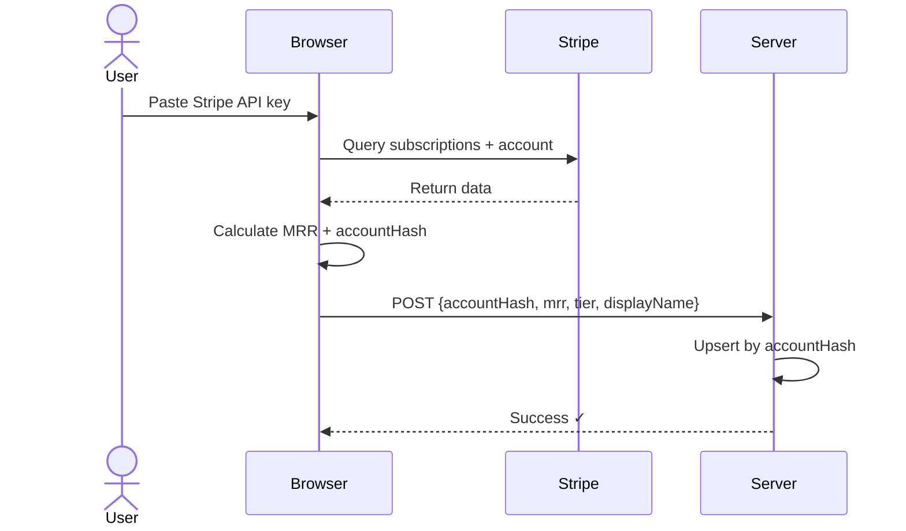

# 👻 GhostMRR

**Verify your startup revenue without exposing your Stripe data. Browser-based, privacy-first.**

## What is GhostMRR?

GhostMRR is a web app that lets indie founders prove their MRR (Monthly Recurring Revenue) without sharing sensitive data:

- ✅ **Browser-based**: Query Stripe API directly in your browser
- ✅ **Privacy-preserving**: Only share MRR tier ($1k+, $10k+, etc) or exact numbers (your choice)
- ✅ **Unique account verification**: One verification per Stripe account using accountHash
- ✅ **Join groups**: Compete on leaderboards or join exclusive clubs like the $10+ MRR Club

---

## Quick Start

### Verify Your MRR in 2 Steps

1. **Visit [ghostmrr.com](https://ghostmrr.com)**
2. **Click "Verify Startup"** and paste your Stripe API key
3. **Done!** Your MRR is calculated instantly and you're verified ✓

**What happens:**
- Browser queries Stripe API (key never leaves your device)
- MRR calculated from active subscriptions
- Unique `accountHash` generated from your Stripe account ID
- Data submitted to server: `{accountHash, mrr, customers, tier, displayName}`
- Your Stripe key is optionally stored encrypted in localStorage for easy re-verification

**Privacy:**
- ✅ API key stays in your browser (never sent to server)
- ✅ Only MRR metrics and accountHash are submitted
- ✅ Choose to show exact numbers or stay anonymous
- ✅ Re-verify anytime by clicking "Re-verify" (uses stored key)

### Join Groups & Compete

After verification:
- Join "Exact Numbers Leaderboard" to show your real MRR
- Join exclusive clubs like ">$10k MRR Club"
- Compete on leaderboards with other verified founders

---

## Architecture

```
ghostmrr/
├── app/                 # Next.js 16 frontend
├── components/          # React components (verification form, badges)
├── lib/
│   ├── stripe/         # Browser-based Stripe calculator
│   ├── types/          # TypeScript interfaces
│   └── supabase/       # Database client
└── supabase/
    └── migrations/     # Database schema
```

### How It Works

**Step 1**: Paste your Stripe API key in the browser (key never leaves your device)

**Step 2**: Browser queries Stripe, calculates MRR and accountHash, and submits the minimal payload `{accountHash, mrr, customers, tier, displayName}` to the server



### Security: Browser-Based Privacy

**Your Stripe API key never leaves your browser:**

- ✅ **Client-side only**: All Stripe queries happen in your browser
- ✅ **No server access**: Server never sees your API key
- ✅ **localStorage encryption**: Key stored encrypted for re-verification convenience
- ✅ **Restricted keys recommended**: Use `rk_live_...` or `rk_test_...` for read-only access
- ✅ **Minimal data sent**: Only `accountHash` (SHA-256 hash), MRR metrics, and display name

**What is accountHash?**
- SHA-256 hash of your Stripe account ID
- Acts as unique identifier (one verification per Stripe account)
- Prevents duplicate verifications
- Allows you to update your MRR over time
- Cannot be reverse-engineered to reveal your Stripe account

**Recommended: Use Restricted API Keys**
Create a restricted key with only `Subscriptions: Read` permission for maximum security.

---

## Tech Stack

### Frontend
- Next.js 16 (App Router)
- React 19
- Tailwind CSS 3.4
- Web Crypto API (SHA-256 for accountHash)
- Stripe API (browser-based queries)
- Supabase Client

### Backend
- Supabase (PostgreSQL database)
- Next.js API routes for badge storage and retrieval
- Account-based deduplication using `accountHash` unique constraint

### Database Schema
```sql
CREATE TABLE verifications (
  id UUID PRIMARY KEY,
  account_hash TEXT UNIQUE NOT NULL,  -- Unique identifier
  display_name TEXT,
  mrr INTEGER NOT NULL,
  tier TEXT NOT NULL,
  customers INTEGER,
  verified_at TIMESTAMP,
  updated_at TIMESTAMP
);
```

---

## Development

```bash
# Install dependencies
pnpm install

# Set up environment variables
cp .env.example .env.local
# Add your Supabase URL and anon key

# Run development server
pnpm run dev

# Open http://localhost:3000
```

**Project Structure:**
- `app/` - Next.js pages and API routes
- `components/` - React components (StripeVerificationForm, badges, etc.)
- `lib/stripe/calculator.ts` - Browser-based MRR calculation
- `lib/types/verification.ts` - TypeScript interfaces
- `supabase/migrations/` - Database migrations

---

## Why GhostMRR?

**Problem**: Founders want to share revenue milestones, but:
- ❌ Sharing Stripe dashboard = security risk
- ❌ Self-reported numbers = not trustworthy
- ❌ Complex CLI tools = friction for non-technical users

**Solution**: GhostMRR
- ✅ Browser-based verification (no CLI, no terminal)
- ✅ Privacy-preserving (API key never leaves browser)
- ✅ Unique account verification (accountHash prevents duplicates)
- ✅ Choose privacy level (exact MRR or tier ranges)
- ✅ Easy re-verification (stored encrypted key)
- ✅ Join verified groups and compete on leaderboards
- ✅ Open source = full transparency

---

## Inspired By

- [TrustMRR](https://github.com/sagarshende23/trustmrr) - UI/UX inspiration
- Privacy-first web applications
- Browser-based cryptography (Web Crypto API)

---

## License

MIT

---

## Contributing

PRs welcome!

---

**Built with 👻 by indie hackers, for indie hackers.**
